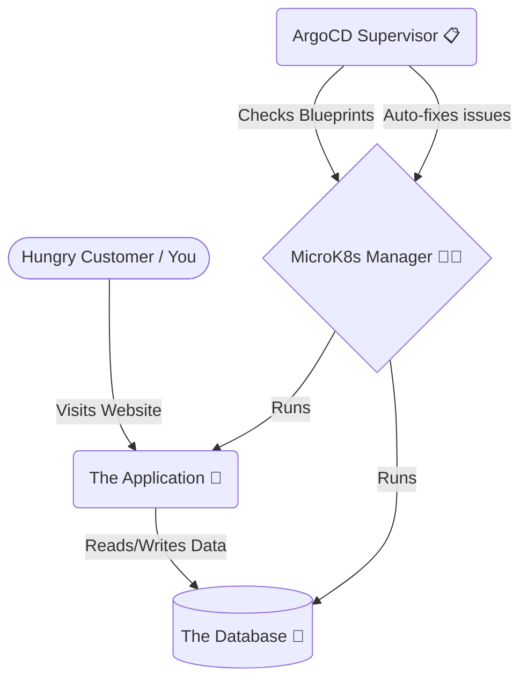
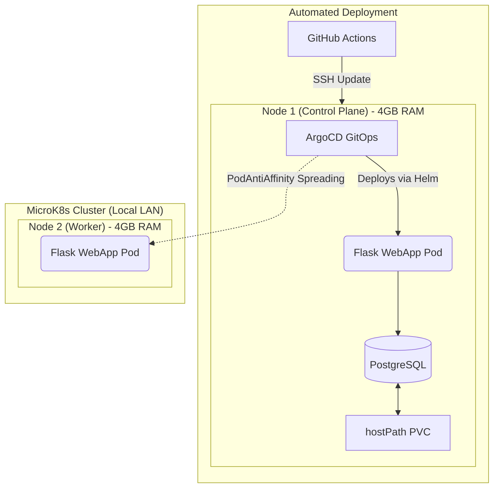
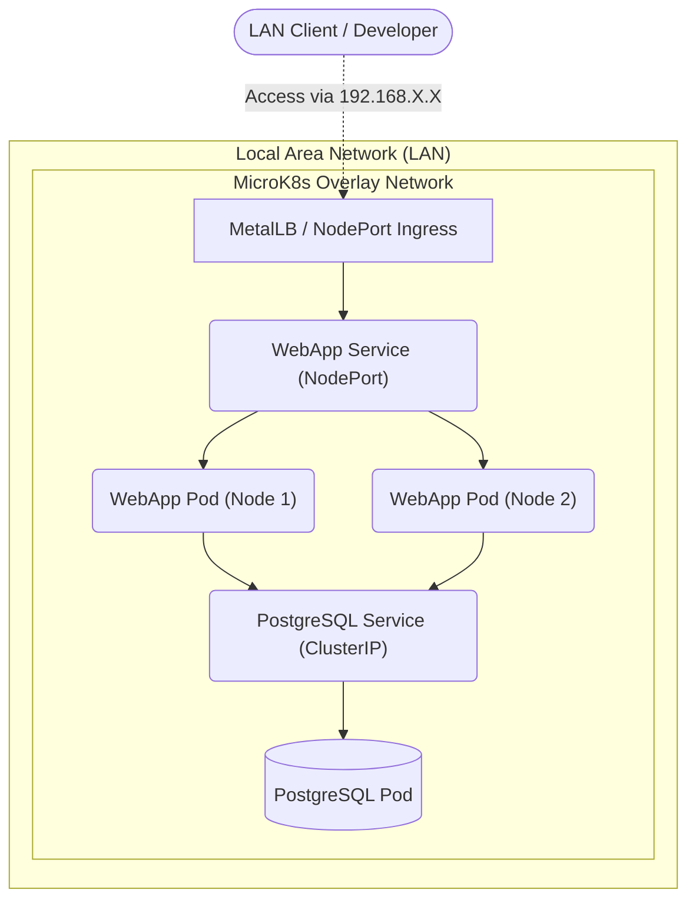

# Repository Overview: MicroK8s DevOps Demo

This document explains what this repository does, divided into two sections: a simple explanation for beginners and a detailed technical breakdown for experts.

---

## The Simple Explanation

Imagine you are running a restaurant. You need cooks, waiters, a kitchen, and a manager to make sure everything runs smoothly, especially during a busy night. 

In the software world, this repository provides all the pieces to run a tiny "restaurant" on your computer using a tool called **MicroK8s** (a lightweight version of Kubernetes, which acts as the restaurant manager).

Here is what is inside the box:
* **The Application (`app/`)**: This is like the food you are serving. It's a simple web application built with Python (using a framework called Flask). 
* **The Database (`manifests/`)**: This is your recipe book and order tickets. It uses PostgreSQL to store data. We've customized it to use very little memory because the computers (nodes) we are using aren't very powerful.
* **The Blueprints (`charts/`)**: Just like a restaurant has blueprints for where tables go, we use something called **Helm** to describe exactly how the web application should be set up on our computers.
* **The Manager's Instructions (`argocd/`)**: A tool called ArgoCD acts as a strict supervisor. It constantly checks if the actual restaurant matches the blueprints. If someone moves a table by accident, ArgoCD puts it back. This automated matching process is called "GitOps."
* **The Automation Bots (`scripts/`)**: Instead of setting up everything by hand, we have robotic bash scripts that build the cluster, install the database, and configure everything for you automatically.
* **The Inspectors (`.github/workflows/`)**: These are automated tests that check if your code is good and safe before you are allowed to deploy it to the actual application.

**Why is this cool?**
Normally, this kind of setup requires renting expensive, powerful servers in the cloud. This repository is specifically designed to run on old or weak computers (like an old laptop or a Raspberry Pi) using your local home Wi-Fi network!

---

## Technical Deep Dive

This repository is a bare-metal, production-style Kubernetes environment utilizing **MicroK8s**, specifically tuned for resource-constrained hardware (2 CPU cores, 4 GB RAM per node) operating in a LAN-only, non-cloud setting.

### Architecture & Components

* **Container Orchestration (MicroK8s)**: Chosen for its low overhead. It is optimized to strip out cloud-provider bloat and run efficiently on bare-metal VMs or old hardware.
* **Application (Python/Flask)**: Located in `app/`. It uses a multi-stage Docker build to keep the final image size minimal and runs as a non-root user for security best practices.
* **Helm Chart (`charts/webapp/`)**: The application is deployed via a custom Helm chart. It implements:
  * **Soft Spreading (PodAntiAffinity)**: Ensures pods are distributed across nodes if possible, but won't fail if only one node is available (`preferredDuringSchedulingIgnoredDuringExecution`).
  * **Downward API**: Exposes pod metadata (like pod name, node name, namespace) as environment variables to the application for better internal observability.
* **Database (`manifests/postgres-lowram.yaml`)**: A single-instance PostgreSQL deployment. It features aggressive memory tuning (e.g., low `shared_buffers`, `work_mem`) to fit within the constrained environment. It persists data using a `hostPath` PVC, avoiding the overhead of network-attached storage or complex CSI drivers.
* **GitOps (`argocd/`)**: Uses ArgoCD for declarative, continuous deployment based on the `app.yaml` Application CRD.
* **CI/CD (`.github/workflows/`)**: Implements an SSH-based pipeline (since it's a LAN environment). GitHub Actions connects to the local nodes via SSH to trigger updates, bypassing the need for public webhooks.
* **Automation (`scripts/`)**: Bash scripts handle bootstrapping. `install.sh` handles initial single-node or two-node setup, automatically writing `hosts.toml` for the MicroK8s containerd daemon to trust the local insecure registry (`localhost:32001`).

### Network Architecture

The network strictly assumes an offline, LAN-only environment without cloud resources.

* **Ingress/Access**: External traffic from the local network reaches the application via a standard `NodePort` or `MetalLB` setup on the `192.168.X.X` subnet.
* **Overlay Network**: Pods communicate internally across the nodes using the default MicroK8s CNI plugin.
* **Internal Services**: The PostgreSQL database is exposed only within the cluster via a `ClusterIP` service, completely isolated from the external LAN.

### Constraints & Design Choices
The entire project revolves around the tight **4GB RAM limitation**. Design choices deliberately favor low resource consumption over high availability (e.g., using local `hostPath` instead of distributed storage like Longhorn or Ceph, which require high CPU/RAM overhead). Every component has been chosen or tuned to prevent node Out-Of-Memory (OOM) kills.
