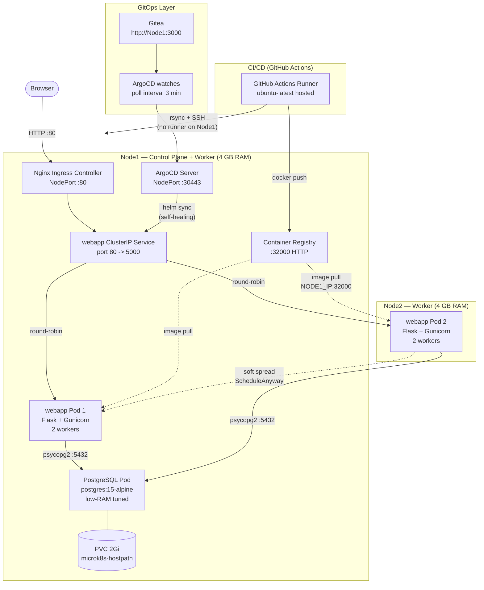

# Architecture

## System Diagram

---

## RAM Budget

Estimated resident memory per component. "Typical RSS" is observed at idle;
"Limit" is the Kubernetes hard limit configured in the manifests.

| Component | Node1 (MB) | Node2 (MB) | Typical RSS | Limit |
|---|---|---|---|---|
| Ubuntu OS + kernel | 400 | 400 | — | — |
| MicroK8s API server + etcd | 250 | 50 | varies | — |
| CoreDNS (2 replicas) | 40 | — | 20 MB each | 170 Mi |
| Nginx Ingress Controller | 80 | — | ~60 MB | 512 Mi |
| Container Registry | 50 | — | ~40 MB | — |
| PostgreSQL (limit 256 Mi) | 180 | — | ~150 MB | 256 Mi |
| webapp Pod x1 (limit 256 Mi) | 150 | 150 | ~100 MB | 256 Mi |
| metrics-server | 30 | — | ~25 MB | 100 Mi |
| ArgoCD (optional) | 300 | — | ~250 MB | — |
| **Total (without ArgoCD)** | **~1,180** | **~600** | | |
| **Free headroom** | **~2,820** | **~3,400** | | |
| **Total (with ArgoCD)** | **~1,480** | **~600** | | |
| **Free headroom (ArgoCD)** | **~2,520** | **~3,400** | | |

> **Safe threshold:** keep total reserved memory below 3,072 MB (3 GB) per node
> to maintain OS stability under burst conditions.
>
> **Do NOT install kube-prometheus-stack** on these nodes — it adds 500–700 MB
> and will cause OOMKill events. Use `metrics-server` instead.
